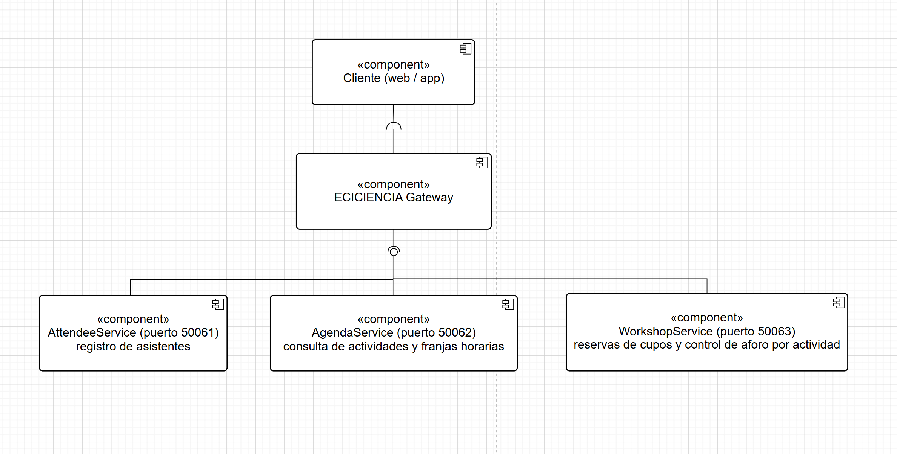

# Ejercicio Integrador Final - Plataforma ECICIENCIA

## 1. Contexto

La plataforma ECICIENCIA debe permitir registrar asistentes, consultar la
agenda del evento, reservar cupos en talleres, controlar el aforo de cada
actividad y consultar actividades por franja horaria.

## 2. Diagrama de arquitectura


## 3. Microservicios y responsabilidades

| Servicio | Responsabilidad | Datos propios |
|----------|------------------|----------------|
| **AttendeeService** | Registrar asistentes y consultar sus datos basicos | id, nombre, correo, tipo de asistente |
| **AgendaService** | Mantener el catalogo de actividades (talleres, charlas, experiencias) y permitir consultarlas por franja horaria | id de actividad, nombre, tipo, franja horaria, sala |
| **WorkshopService** | Gestionar la reserva de cupos en talleres y el control de aforo (cupos disponibles vs. ocupados) por actividad | id de actividad, aforo maximo, cupos ocupados, lista de asistentes inscritos |

La separacion sigue el mismo criterio usado en la Parte 5: cada servicio
gestiona un tipo de dato independiente. `AttendeeService` no necesita saber
nada de talleres; `AgendaService` describe el "que y cuando" de cada
actividad sin saber quien esta inscrito; `WorkshopService` es el unico que
conoce el estado de ocupacion de cada actividad y depende de un id de
asistente (de `AttendeeService`) y de un id de actividad (de
`AgendaService`) para registrar una reserva.

## 4. Contrato gRPC propuesto (WorkshopService)

Se propone el contrato de `WorkshopService`, por ser el que concentra la
logica mas sensible (control de aforo y reservas):

```proto
syntax = "proto3";
option java_multiple_files = true;
option java_package = "edu.eci.arsw.workshop";
option java_outer_classname = "WorkshopProto";

service WorkshopService {
  rpc ReserveSlot (ReserveSlotRequest) returns (ReserveSlotResponse);
  rpc GetCapacity (CapacityRequest) returns (CapacityResponse);
  rpc GetActivitiesByTimeSlot (TimeSlotRequest) returns (ActivityList);
}

message ReserveSlotRequest {
  string attendeeId = 1;
  string activityId = 2;
}

message ReserveSlotResponse {
  bool success = 1;
  string message = 2;
}

message CapacityRequest {
  string activityId = 1;
}

message CapacityResponse {
  string activityId = 1;
  int32 maxCapacity = 2;
  int32 occupied = 3;
  int32 available = 4;
}

message TimeSlotRequest {
  string timeSlot = 1;
}

message Activity {
  string id = 1;
  string name = 2;
  string timeSlot = 3;
  string room = 4;
}

message ActivityList {
  repeated Activity activities = 1;
}
```

`ReserveSlot` aplica la regla de control de aforo: si `occupied >=
maxCapacity`, la reserva se rechaza con `success = false` y un mensaje
explicativo, sin necesidad de que el cliente conozca el aforo de antemano.

## 5. Descripción del Gateway (ECICIENCIA Gateway)

El Gateway centraliza el acceso a los 3 microservicios y expone operaciones
de alto nivel orientadas al caso de uso, por ejemplo:

- `registerAttendee(name, email)` -> delega en `AttendeeService`
- `getAgenda(timeSlot)` -> delega en `AgendaService.GetActivitiesByTimeSlot`
  (o en `WorkshopService.GetActivitiesByTimeSlot` segun donde se modele la
  agenda)
- `reserveWorkshop(attendeeId, activityId)` -> delega en
  `WorkshopService.ReserveSlot`
- `getAttendeeSummary(attendeeId)` -> combina datos de `AttendeeService` y
  las reservas activas en `WorkshopService` para mostrar un resumen unico

Al igual que en `WellnessGateway` (Parte 6), el cliente final solo conoce el
Gateway; los 3 microservicios y sus puertos quedan ocultos detras de el.

## 6. Reflexión: evolución arquitectónica del taller

El taller recorrio un camino que va de la comunicacion mas basica y manual
hacia la mas estructurada y desacoplada. En la Parte 1 (sockets TCP), todo el
"contrato" entre cliente y servidor era una convencion de texto escrita a
mano (`CONSULTAR_SALON,E303`), sin ninguna verificacion automatica: un error
de tipeo en cualquiera de los dos lados rompia la comunicacion en tiempo de
ejecucion. La Parte 2 (HTTP) no cambio la naturaleza del contrato -seguia
siendo texto interpretado manualmente- pero lo estandarizo: en lugar de un
protocolo inventado, se usaron rutas, metodos y query strings que cualquier
herramienta (navegador, curl, Postman) ya sabe interpretar.

La Parte 3 (RMI) dio un salto distinto: el contrato dejo de ser texto y se
convirtio en una interfaz Java verificada por el compilador. La comunicacion
remota empezo a sentirse como una llamada local, pero a costa de quedar
atada por completo al ecosistema Java.

A partir de la Parte 4 (gRPC), el contrato se formalizo en un artefacto
independiente del lenguaje -el archivo `.proto`- que genera codigo para
cliente y servidor de forma automatica y es, en principio, interoperable con
cualquier lenguaje. La Parte 5 (microservicios) aplico ese mismo mecanismo
pero distribuyendo la responsabilidad: en lugar de un unico servicio que
hace todo, cada `.proto` describe un dominio pequeno y cohesivo
(`appointment.proto`, `gym.proto`), cada uno corriendo de forma
independiente en su propio puerto.

Finalmente, la Parte 6 (API Gateway) resolvio el problema que la propia
descomposicion en microservicios habia creado: un cliente que ahora debia
conocer multiples direcciones, puertos y contratos. El Gateway centraliza
ese conocimiento, exponiendo al cliente operaciones de alto nivel
(`getStudentWellnessSummary`) que internamente orquestan varias llamadas RPC.

El ejercicio ECICIENCIA es la culminacion natural de ese recorrido: requiere
identificar de entrada los limites de cada microservicio (Attendee, Agenda,
Workshop), definir su contrato formal en `.proto`, y disenar un Gateway que
oculte esa descomposicion al cliente final. Un unico servicio monolitico
para ECICIENCIA mezclaria datos de asistentes, agenda y control de aforo en
un mismo modelo, dificultando que, por ejemplo, el control de aforo (que
probablemente necesita actualizarse con alta frecuencia durante el evento)
pueda escalarse o desplegarse de forma independiente del registro de
asistentes (que es mayormente de lectura una vez terminado el registro
previo al evento). Separar estos dominios desde el diseño permite que cada
uno evolucione, se escale y se despliegue segun sus propias necesidades, que
es precisamente la ventaja que el taller fue mostrando paso a paso en cada
estilo arquitectonico.