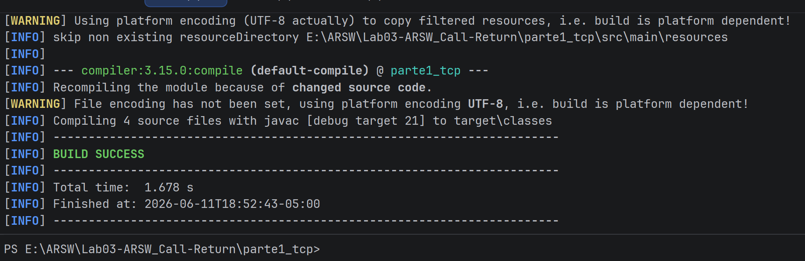
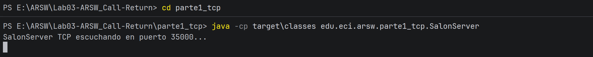
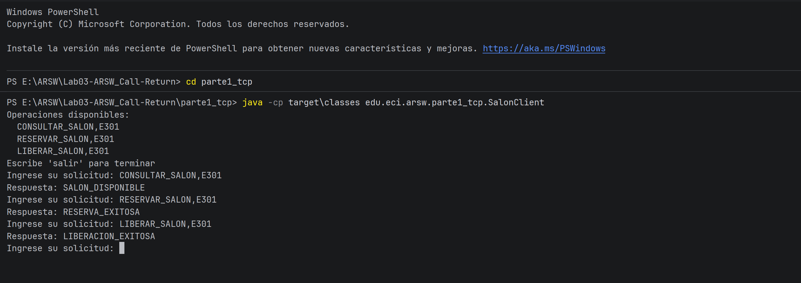

# Parte 1 - Sockets TCP

## Descripción
Sistema de gestión de salones de la Escuela implementado con sockets TCP.
El servidor escucha en el puerto 35000 y procesa solicitudes en texto plano
según un protocolo definido manualmente.

## Salones disponibles
E301, E302, E303, E304 (todos inician como DISPONIBLE)

## Protocolo

| Operación | Formato | Respuestas posibles |
|-----------|---------|---------------------|
| Consultar | `CONSULTAR_SALON,E303` | `SALON_DISPONIBLE` / `SALON_RESERVADO` |
| Reservar  | `RESERVAR_SALON,E303`  | `RESERVA_EXITOSA` / `ERROR_OPERACION_INVALIDA` |
| Liberar   | `LIBERAR_SALON,E303`   | `LIBERACION_EXITOSA` / `ERROR_OPERACION_INVALIDA` |

Si el salón no existe: `ERROR_SALON_NO_EXISTE`

## Cómo ejecutar

Compilar:
```powershell
cd parte1_tcp
mvn compile
```

Servidor (terminal 1):
```powershell
java -cp target\classes edu.eci.arsw.parte1_tcp.SalonServer
```

Cliente (terminal 2):
```powershell
java -cp target\classes edu.eci.arsw.parte1_tcp.SalonClient
```

## Ejemplo de ejecución





