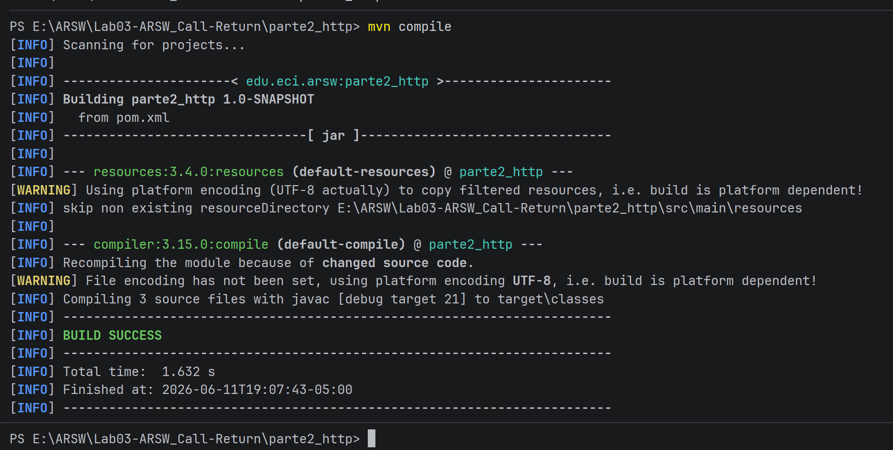
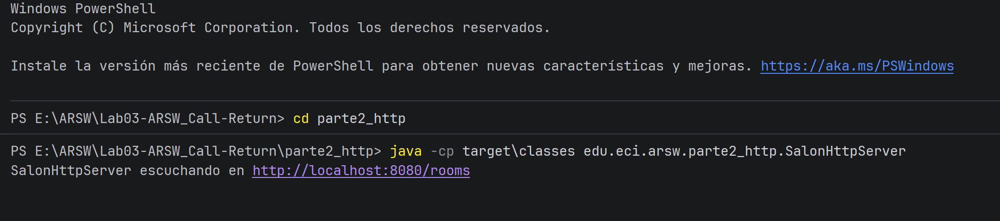

# Parte 2 - HTTP

## Descripción
El mismo sistema de gestión de salones, ahora expuesto mediante HTTP usando
`com.sun.net.httpserver` (sin frameworks). Puede probarse desde el navegador
o con curl/Postman.

## Rutas

| Método | Ruta | Descripción |
|--------|------|-------------|
| GET | `/rooms` | Lista todos los salones |
| GET | `/rooms?id=E303` | Consulta un salón específico |
| POST | `/rooms/reserve?id=E303` | Reserva el salón |
| POST | `/rooms/release?id=E303` | Libera el salón |

## Cómo ejecutar

Compilar:
```powershell
cd parte2_http
mvn compile
```

Servidor:
```powershell
java -cp target\classes edu.eci.arsw.parte2_http.SalonHttpServer
```

## Ejemplo de uso

Listar salones (navegador o curl):
```
http://localhost:8080/rooms
```


